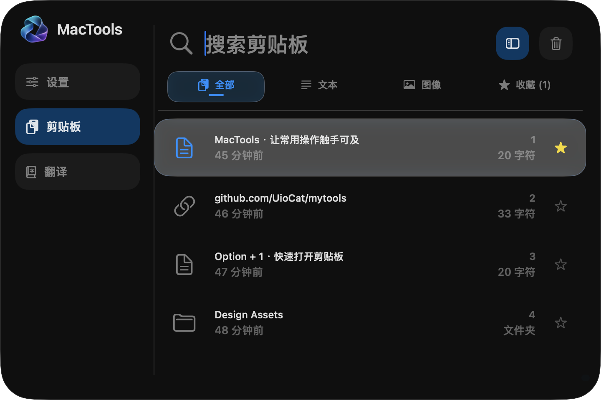
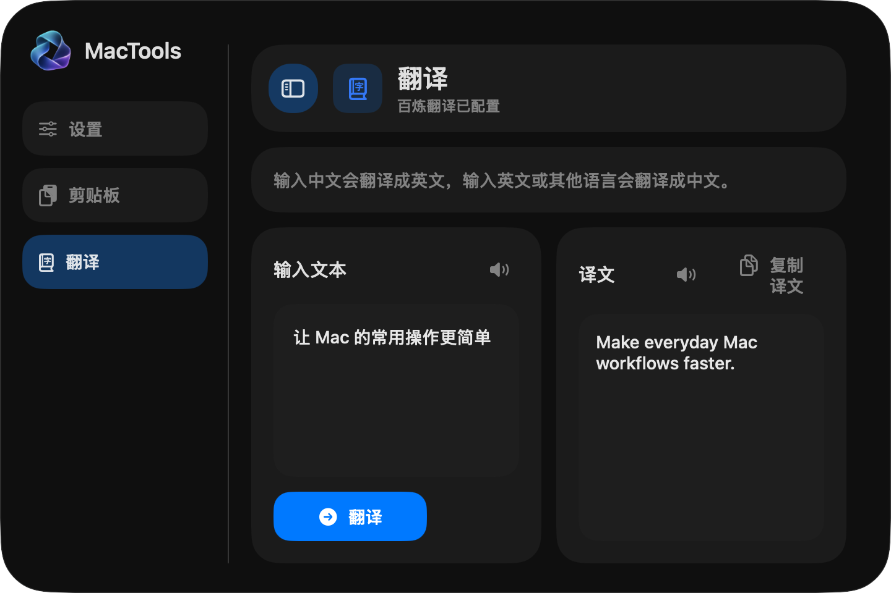
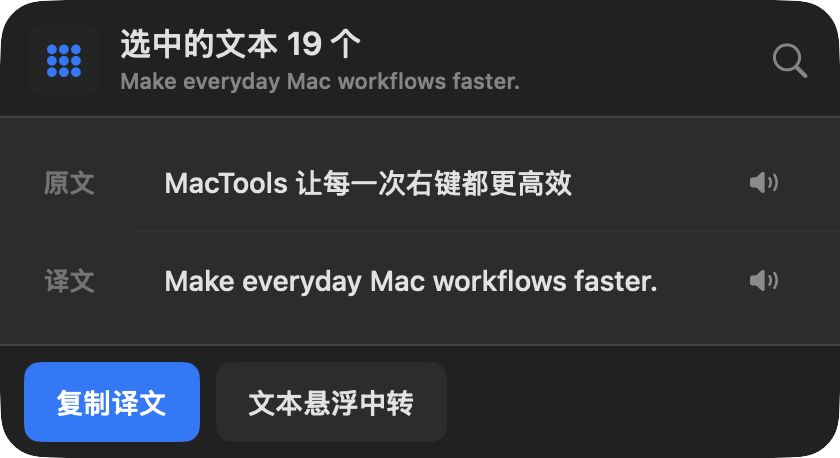
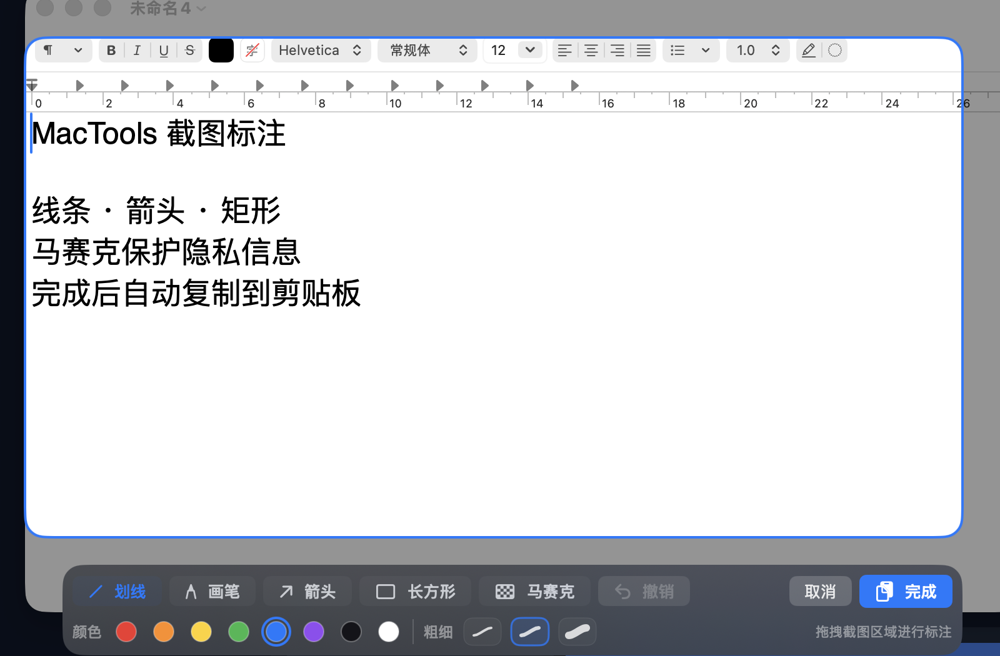

# MacTools

一款常驻菜单栏的原生 macOS 效率工具，把剪贴板、翻译、超级右键、截图录屏和窗口布局集中到一个轻量应用里。

MacTools 默认不显示 Dock 图标，需要时通过菜单栏或全局快捷键立即唤起。所有主要功能都可在应用内配置，无需重启。

> 当前支持 macOS 26 及以上版本。下方截图来自实际打包应用，使用专门准备的演示数据，不包含个人剪贴板、账户、路径或 API Key。

## 核心功能

| 功能 | 你可以做什么 |
| --- | --- |
| **剪贴板历史** | 自动记录文本、链接、文件、文件夹和图片；支持搜索、分类、收藏、删除，以及复制后自动粘贴 |
| **百炼翻译** | 中文自动翻译成英文，英文及其他语言自动翻译成中文；支持复制译文和系统语音朗读 |
| **超级右键** | 短按继续使用系统右键菜单，长按快速处理选中文本、Finder 项目或当前文件夹 |
| **截图与录屏** | 自由框选屏幕区域；截图支持画笔、箭头、矩形、颜色、线宽和马赛克，录屏输出 H.264 MP4 |
| **窗口布局** | 一键将当前窗口调整为半屏、1/3、2/3、居中或满屏，并可为每种布局配置多个快捷键 |
| **统一设置** | 管理外观、快捷键、剪贴板缓存、超级右键响应速度、翻译服务、窗口布局和权限状态 |

## 界面预览

<table>
  <tr>
    <td width="50%" align="center">
      
      <br />
      <strong>剪贴板历史</strong><br />搜索、分类、收藏并快速复用最近内容
    </td>
    <td width="50%" align="center">
      
      <br />
      <strong>百炼翻译</strong><br />双栏查看原文和译文，并可复制或朗读
    </td>
  </tr>
  <tr>
    <td width="50%" align="center">
      
      <br />
      <strong>超级右键</strong><br />长按右键直接翻译、复制或中转选中文本
    </td>
    <td width="50%" align="center">
      
      <br />
      <strong>截图标注</strong><br />在原选区内完成标注、马赛克和复制
    </td>
  </tr>
</table>

## 功能详情

### 剪贴板历史

- 记录文本、URL、文件、文件夹和图片，并按内容类型快速筛选。
- 支持搜索、键盘导航、收藏、单条删除和清空未收藏记录。
- 单击选中，再次点击可复制并自动粘贴到之前使用的应用。
- 收藏内容不会被“清空未收藏记录”删除。

### 百炼翻译

- 使用阿里云百炼 `qwen-mt-turbo` 模型和 DashScope OpenAI 兼容接口。
- 自动判断翻译方向：中文译为英文，其他语言译为中文。
- 原文和译文都可使用 macOS 系统音色朗读，也可以一键复制译文。
- 使用前需在设置中填写自己的 `DASHSCOPE_API_KEY`。

### 超级右键

长按右键会根据当前内容展示不同动作；普通短按仍然打开系统右键菜单。

| 当前场景 | 可用动作 |
| --- | --- |
| 选中文本 | 查看翻译、朗读、复制译文、打开文本悬浮中转 |
| Finder 已选项目 | 复制文件路径、使用已启用的窗口布局 |
| Finder 当前文件夹 | 新建文本文件、复制目录路径、在终端打开、调整窗口布局 |
| 其他窗口 | 使用已启用的窗口布局 |

长按响应速度可选择 `250 / 300 / 350 ms`。

### 截图与录屏

- 从菜单栏或快捷键进入，在当前显示器上拖动选择区域。
- 截图支持线条、自由画笔、箭头、矩形、八种颜色、三档线宽、马赛克和撤销。
- 完成后的 PNG 直接写入剪贴板，不额外保存文件。
- 录屏生成不含音频的 H.264 MP4，并保存到“下载”目录。
- 同一时间只允许一个截图或录屏会话，按 `Esc` 可取消。

### 窗口布局

支持左/右半屏、左/右 `1/3`、左/右 `2/3`、居中和满屏八种模式。每种布局都可以：

- 在超级右键面板中显示或隐藏。
- 添加一个或多个全局快捷键。
- 直接作用于当前聚焦窗口。

## 默认快捷键

所有快捷键都可以在设置中修改。

| 快捷键 | 动作 |
| --- | --- |
| `Option + Space` | 打开设置 |
| `Option + 1` | 打开剪贴板历史 |
| `Option + 2` | 打开翻译 |
| `Option + 3` | 启动截图与录屏 |
| `Control + Command + ← / →` | 左/右半屏 |
| `Control + Option + ← / →` | 左/右 `1/3` |
| `Option + Command + ← / →` | 左/右 `2/3` |
| `Control + Option + 0` | 窗口居中 |
| `Control + Command + 0` | 窗口满屏 |

## 安装与运行

### 系统要求

- macOS 26 或更高版本。
- Xcode 或 Xcode Command Line Tools。
- 首次构建需要联网下载 [GRDB.swift](https://github.com/groue/GRDB.swift) 依赖。

### 从源码构建

```sh
git clone https://github.com/UioCat/mytools.git
cd mytools
scripts/rebuild_and_run_app.sh
```

脚本会构建、签名并启动 `build/MacTools.app`。如果本机没有可用的 Apple 开发签名，会回退到临时签名；此时系统权限可能无法在后续构建中稳定继承。

## 系统权限

MacTools 只在使用对应功能时需要以下权限：

| 权限 | 用途 |
| --- | --- |
| 辅助功能 | 读取选中文本、自动粘贴、获取并移动当前窗口 |
| 输入监控 | 识别全局右键的短按和长按 |
| 屏幕与系统音频录制 | 获取用户框选的截图或录屏区域 |
| Finder 自动化 | 在辅助功能信息不足时读取 Finder 当前文件夹 |

首次运行时，请根据应用内权限状态前往“系统设置 → 隐私与安全性”完成授权。Finder、超级右键、截图录屏和窗口布局应使用打包后的 `build/MacTools.app` 验证，`swift run MacTools` 不适合作为这些系统权限行为的最终运行方式。

## 数据与隐私

剪贴板历史、图片缓存、设置和运行日志默认保存在：

```text
~/Library/Application Support/MacTools/
```

- 剪贴板元数据使用 SQLite 保存，图片数据存放在独立缓存目录。
- 默认最多保留 `500` 条历史记录，默认缓存上限为 `1024 MB`，都可以在设置中调整。
- 当前百炼 API Key 保存在权限为 `0600` 的 `settings.json` 中，尚未迁移到钥匙串；请勿分享该文件。
- 请勿将 `Clipboard.sqlite`、`ClipboardCache/`、`settings.json`、`debug.log` 或录屏文件提交到公开仓库。

## 开发者入口

```sh
# 运行完整测试
swift test

# SwiftPM 开发运行
swift run MacTools

# 仅构建和签名 App Bundle
scripts/package_app.sh
```

- [架构图](docs/architecture/mac-tools-architecture.html)
- [人工验收清单](docs/manual-verification.md)
- [超级右键诊断设计](docs/super-right-click-debuggable-design.md)
