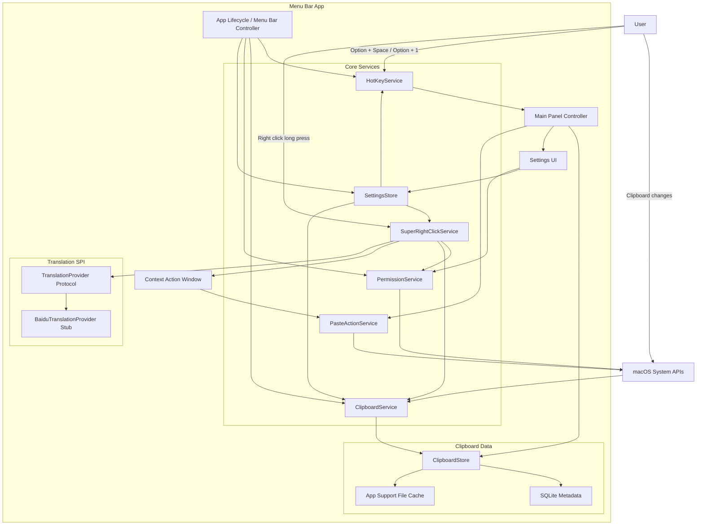

# Mac Tools MVP Design

## Summary

Build a Mac-only lightweight desktop productivity tool inspired by uTools. The MVP is a native menu bar app that stays resident in the background, exposes a searchable main panel, records clipboard history, and supports a configurable "super right click" gesture for contextual actions.

The first version focuses on a reliable native Mac foundation rather than a plugin marketplace. The app should be modular internally so future tools can be added without rewriting the hotkey, settings, permission, or panel systems.

## Goals

- Run as a resident menu bar app on macOS.
- Hide the Dock icon by default.
- Open the main panel with `Option + Space`.
- Support configurable per-tool shortcuts.
- Default `Option + 1` to the clipboard tool.
- Reserve `Option + 2` and `Option + 3` for future tools.
- Record clipboard history for text, files, folders, image files, and copied image data.
- Support clipboard search, pinned items, favorites, copy-only, and copy-and-paste actions.
- Support a configurable right-click long-press gesture.
- Translate selected text to Chinese through a translation provider SPI.
- Offer folder/file actions through a small contextual action window.
- Guide the user through required macOS permissions when missing.

## Non-Goals For MVP

- Windows or Linux support.
- Marketplace-style external plugins.
- Sandboxed script execution.
- Sensitive-content filtering.
- Translation API implementation before provider credentials are supplied.
- Export/backup workflows.
- OCR, AI command execution, or file indexing outside clipboard history.

## Technology Choice

Use a native macOS application built with SwiftUI and AppKit.

SwiftUI will cover the main panel, settings, clipboard list, and contextual action windows. AppKit will handle menu bar behavior, global hotkeys, panel/window control, pasteboard details, permission checks, and system event handling.

The MVP should be a single app process with clear internal service boundaries. A separate helper/background process is deferred until there is a concrete need for login-item isolation, crash isolation, or privileged background behavior.

## Internal Module Diagram

## Main Entry And Window Model

The app runs from the menu bar. It does not show a Dock icon by default.

`Option + Space` opens the main panel. The panel combines a launcher, management surface, and settings entry:

- Top search field.
- Results for matching tools, clipboard items, pinned items, and favorites.
- Keyboard navigation with arrow keys.
- `Enter` executes the highlighted result.
- `Esc` closes the panel.
- A settings entry is available through a gear icon or tab.

Default tool hotkeys:

- `Option + 1`: clipboard tool.
- `Option + 2`: reserved, configurable, no default tool.
- `Option + 3`: reserved, configurable, no default tool.

All hotkeys are editable from settings. The app should detect obvious shortcut conflicts when possible and allow restoring defaults.

## Clipboard Module

`ClipboardService` monitors the system pasteboard and stores normalized history records through `ClipboardStore`.

Supported clipboard item classes:

- Text.
- URL-like text.
- File paths.
- Folder paths.
- Image file paths copied from Finder.
- Raw copied image data, such as screenshots or image data copied from another app.

Each clipboard item stores:

- Stable identifier.
- Content type.
- Display title.
- Searchable summary.
- Full text content or local file reference.
- Original file or folder path when available.
- Source app when available.
- Created time.
- Last used time.
- Use count.
- Pinned flag.
- Favorite flag.

Image handling:

- If the clipboard contains an image file copied from Finder, record the file path and generate a preview.
- If the clipboard contains raw image data without a source path, save a local copy under the app's Application Support directory and reference it from metadata.
- Generate thumbnails for display in the clipboard panel.
- Restore the correct pasteboard type when the user reuses an image item.

Clipboard interactions:

- `Option + 1` opens the clipboard list.
- Searching matches text content, filenames, paths, source apps, pinned items, and favorites.
- `Enter` or click copies the selected item and automatically pastes into the previously active app.
- `Cmd + Enter` copies the selected item without automatic paste.
- Pinned items appear above normal history.
- Favorites are available through filtering or a separate view.

Storage:

- Use SQLite for metadata.
- Store raw image data and other large local copies under Application Support.
- Provide settings for maximum history count and image/file-cache storage limit.
- Support pause recording and clear history.
- Do not filter or classify sensitive information in the MVP.

## Super Right Click Module

`SuperRightClickService` listens for right-click press/release events through macOS system event APIs and requires the appropriate accessibility permissions.

Trigger rules:

- Short right-click preserves the standard macOS context menu.
- Long right-click activates the custom flow.
- Default long-press threshold is 600 ms.
- The threshold is configurable in settings.

Content capture:

- On long-press activation, save the current pasteboard state as best as possible.
- Temporarily simulate `Cmd + C`.
- Read the selected content from the pasteboard.
- Classify the selection as text, file, folder, path, image, or unknown.
- Restore the previous pasteboard contents where practical.

Actions:

- Selected text executes the default action: translate to Chinese.
- Folder selections open a compact action window with:
  - Copy folder path.
  - Open in Terminal.app.
- File selections open a compact action window with:
  - Copy file path.
  - Reveal in Finder.
- Unknown content shows a lightweight status message.

Terminal behavior:

- Use Apple's built-in Terminal.app.
- Opening a folder in Terminal should fail gracefully if the path no longer exists or is not a folder.

## Translation SPI

Translation is exposed through a provider protocol:

- Input text.
- Source language hint, optional.
- Target language, default Chinese.
- Async result with translated text and provider metadata.
- Error result for missing credentials, network failures, provider failures, or unsupported configuration.

The MVP includes a `BaiduTranslationProvider` stub but does not implement the live API until credentials and exact provider details are supplied.

Credentials should be stored in Keychain once implemented. They should not be written as plaintext in app configuration files.

If no translation provider is configured, selected text long-press should show a clear "translation service not configured" message instead of failing silently.

## Permissions

`PermissionService` checks and presents state for:

- Accessibility permission, required for global event behavior and selection capture.
- Input monitoring permission if required by the final event-monitoring implementation.
- Login item state if launch-at-login is enabled later.

If required permissions are missing:

- Disable dependent features.
- Show visible status in settings.
- Provide a button to open the relevant macOS System Settings page.
- Allow users to re-check permission state after granting access.

## Settings

Settings sections:

- Shortcuts:
  - Main panel shortcut.
  - Clipboard shortcut.
  - Reserved tool shortcuts.
  - Conflict detection.
  - Restore defaults.
- Clipboard:
  - Enable or pause recording.
  - Maximum history count.
  - Image/cache storage limit.
  - Clear history.
  - Open data directory.
- Super right click:
  - Enable or disable.
  - Long-press threshold.
  - Text default action.
  - Folder actions.
  - File actions.
- Translation:
  - Provider status.
  - Baidu provider stub status.
  - API configuration entry reserved for later.
- Permissions:
  - Permission status.
  - Open System Settings.
  - Re-check permissions.
- Data:
  - Data directory.
  - Storage usage.
  - Clear image/cache files.

Settings should be persisted locally and loaded before services register hotkeys or event monitors.

## Error Handling

Use lightweight, non-blocking feedback:

- Toast or status text for action failures.
- Settings warnings for missing permissions.
- Empty states for no clipboard history or no search results.
- Clear provider-state messages for unconfigured translation.

Expected failure cases:

- Missing accessibility permission.
- Shortcut unavailable or conflicting.
- Clipboard item cannot be restored exactly.
- Target app does not accept automatic paste.
- File or folder path no longer exists.
- Translation provider missing or unavailable.
- Image cache exceeds configured limits.

## Testing Strategy

Unit tests:

- Clipboard item classification.
- Search indexing and filtering.
- Pinned/favorite ordering.
- Settings persistence.
- Storage limit calculations.
- Translation provider error states.

Integration tests:

- Simulated pasteboard changes.
- Text, file, folder, image-file, and raw-image recording.
- Restoring clipboard items to the pasteboard.
- Local image cache creation and cleanup.

Manual verification:

- `Option + Space` opens and closes the main panel.
- `Option + 1` opens the clipboard tool.
- Keyboard navigation and search work.
- `Enter` copies and auto-pastes.
- `Cmd + Enter` copies only.
- Right-click short press preserves the system menu.
- Right-click long press triggers custom behavior.
- Folder actions copy path and open Terminal.app.
- Missing permissions show guidance.
- Translation stub reports unconfigured provider state.

## Implementation Notes

The first implementation should preserve the single-app architecture while keeping services small and independently testable. Avoid building a general plugin runtime during the MVP. The service boundaries above are enough to add new internal tools later.
