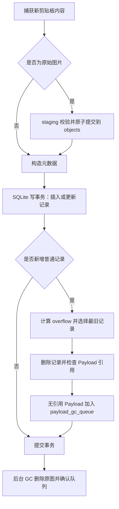
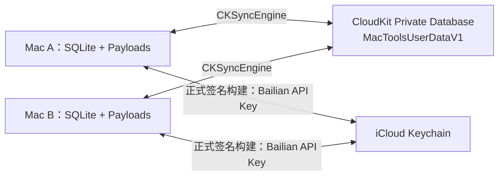

# MacTools 统一存储与 CloudKit 同步历史方案

> CloudKit 同步后端已由 [MacTools iCloud Drive 多设备同步设计](2026-07-20-icloud-drive-sync-design.md) 替代。本文件中的统一本地存储、Payload 生命周期和本机 500 条淘汰规则继续有效；CloudKit、CKSyncEngine、应用专属 Container、APNs、CloudKit 加密和正式签名要求不再作为当前实现目标。

## 文档状态

- 状态：本地统一存储已实现；CloudKit 同步章节已废止。
- 已确认：采用统一 SQLite 与内容寻址 Payload 存储；不要求运行时兼容旧结构，通过一次性迁移切换。
- 已确认：剪贴板普通历史固定保留 500 条，在新增记录时懒淘汰；淘汰图片记录时回收无引用的原图 Payload。
- 已确认：剪贴板数据与可同步配置均使用 iCloud 多设备同步；本地数据库始终是运行时数据源。
- 已确认：不引入 MacTools 自有同步主密钥和应用层内容加密；文字、配置使用 CloudKit 加密字段，图片使用 CloudKit 默认加密的 `CKAsset`。
- 已确认：Keychain 仅保存 Bailian API Key；iCloud 同步不依赖 MacTools 自行读取或管理加密密钥。
- 已确认：默认剪贴板同步范围为“仅收藏与置顶”；历史上限固定展示为 500，不提供路径或容量编辑入口。
- 待确认：正式 Bundle ID、CloudKit Container ID、签名证书与 Provisioning Profile。

## 改动需求

### 功能需求

| 编号 | 需求 | 用户可感知结果 |
| --- | --- | --- |
| R1 | 统一本地存储 | 剪贴板、普通配置和同步状态统一由本地 SQLite 管理，原始图片由 Payload 对象库管理 |
| R2 | 图片生命周期完整 | 删除或淘汰图片记录后，无引用原图最终从磁盘删除；失败可在重启后继续回收 |
| R3 | 落实 500 条历史上限 | 普通记录固定最多 500 条，新增时按最后活动时间懒淘汰；收藏和置顶不自动删除 |
| R4 | 提供 iCloud 总开关 | 在“设置 → 数据与同步”控制当前 Mac 是否参与同步；关闭不删除本机或云端数据 |
| R5 | 同步剪贴板 | 文字、URL 和原始图片可跨 Mac 同步；文件、文件夹和图片文件路径不跨设备同步 |
| R6 | 同步普通配置 | 快捷键、外观、翻译非敏感配置、超级右键、窗口布局、截图偏好和同步策略跨设备合并 |
| R7 | 保护敏感信息 | Bailian API Key 从 `settings.json` 迁入 Keychain，不写入 SQLite、CloudKit 普通字段或日志 |
| R8 | 支持多设备并发 | 多台 Mac 同时新增、修改、删除或离线恢复后最终收敛，不产生剪贴板反馈循环 |
| R9 | 一次性迁移 | 旧 `Clipboard.sqlite`、`ClipboardCache/` 和 `settings.json` 迁入新结构，验证成功后切换运行时数据源 |

### 非功能需求

| 维度 | 要求 |
| --- | --- |
| 本地优先 | 无网络、iCloud 未登录或同步关闭时，本机记录、搜索、复制和设置修改仍可使用 |
| 一致性 | SQLite 事务决定业务状态；文件删除和云端上传失败不得破坏本地已提交数据 |
| 隐私 | 不记录剪贴板正文、图片内容、API Key、Authorization Header 或真实用户路径 |
| 性能 | 剪贴板轮询和主界面不等待网络；图片 I/O、GC 和 CloudKit 同步在后台执行 |
| 可恢复性 | 文件回收、网络同步、CloudKit 冲突和迁移失败均可重试，不以明文降级绕过错误 |

## 目标与边界

### 目标

- 将剪贴板元数据、普通配置、设备覆盖配置和同步状态收敛到一个本地数据库。
- 将原始图片从易失的 `ClipboardCache` 升级为有生命周期管理的 `Payload`。
- 让“历史上限 500 条”成为真实存储规则，而不是只限制界面查询数量。
- 在多台 Mac 同时离线或在线使用时，保证数据最终收敛，不直接同步 SQLite 文件。
- 将普通配置通过 CloudKit 同步，将 Bailian API Key 迁入 Keychain。
- 由 CloudKit 管理文字、配置和图片的云端加密，不在 MacTools 内维护额外同步主密钥。

### 边界

- 文本和 URL 直接保存在 SQLite；原始剪贴板图片保存在 Payload 对象库。
- Finder 文件、文件夹和图片文件只保存原路径，不复制文件内容，也不跨设备同步路径记录。
- 截图模块仍只把完成后的 PNG 写入系统剪贴板，不额外保存截图副本；被剪贴板监听捕获后才进入统一存储。
- 500 条上限是每台设备的本地保留规则；自动淘汰不传播为云端删除，只有用户主动删除、清空或重置云端数据会跨设备生效。

## 当前实现与问题

| 现状 | 问题 | 目标调整 |
| --- | --- | --- |
| `maxHistoryCount` 固定 500 | 仅作为 `SELECT ... LIMIT`，SQLite 记录没有真实上限 | 写入事务内执行普通历史淘汰 |
| `ClipboardService` 先写图片文件，再调用 `ClipboardRepository.upsert` | 数据库失败时可能遗留孤儿文件 | 通过 staging、对象提交和垃圾回收恢复一致性 |
| `FileCache` 按文件修改时间直接删除文件 | 不检查数据库引用，可能留下指向不存在图片的记录 | 所有 Payload 删除必须先解除引用，再异步回收对象 |
| 删除记录或清空非收藏记录只删除 SQLite 行 | 对应图片原图继续占用磁盘 | 所有删除入口统一进入 Payload 引用回收流程 |
| `settings.json` 是配置运行时数据源，并包含明文 API Key | 不适合多设备合并，敏感信息不应继续保存在普通文件 | 普通配置迁入 SQLite；敏感值迁入 Keychain |
| `Clipboard.sqlite`、`ClipboardCache/` 和配置相互独立 | 无法形成统一事务、迁移和同步边界 | 收敛为 `Store/` 与 `Payloads/` |
| 设置页没有 iCloud 开关和同步状态 | 用户无法控制当前 Mac 是否同步，也无法判断失败原因 | 增加独立“数据与同步”设置卡片 |

## 本地存储 L1 结构

```text
~/Library/Application Support/MacTools/
├── Store/
│   ├── mactools.sqlite3
│   ├── mactools.sqlite3-wal
│   ├── mactools.sqlite3-shm
│   └── Payloads/
│       ├── store.json
│       ├── objects/
│       │   └── sha256/<前两位>/<SHA-256>.png
│       └── staging/
├── Store.migrating/              # 迁移期间临时目录，切换成功后消失
├── Store.rollback-<时间戳>/       # 仅在发现未完成的新 Store 时保留的隔离副本
├── Clipboard.sqlite              # 旧版迁移源，观察期内保留
├── ClipboardCache/               # 旧版图片迁移源，观察期内保留
├── settings.json                 # 旧版配置迁移源；Keychain 成功后不再含 API Key
└── debug.log
```

正常运行只依赖 `Store/`。`Store.migrating/` 与 `Store.rollback-*` 是迁移恢复结构；旧版三项仅作为一次性迁移与回滚来源，不再参与运行时读写。

### SQLite 文件

三个 SQLite 文件组成同一个逻辑数据库：

| 文件 | 职责 |
| --- | --- |
| `mactools.sqlite3` | 主数据库，保存业务表和同步状态 |
| `mactools.sqlite3-wal` | Write-Ahead Log，保存尚未合并回主库的事务页 |
| `mactools.sqlite3-shm` | WAL 读写协调和索引 |

`-wal` 和 `-shm` 由 SQLite 自动维护，可能随运行状态出现或消失。应用运行时不能只复制主数据库文件作为备份；备份必须使用 SQLite/GRDB 的一致性备份能力，或关闭应用并完成 checkpoint 后复制。

### Payloads 内容

| 位置 | 内容 | 生命周期 |
| --- | --- | --- |
| `store.json` | Payload 存储格式版本和布局标识，不保存用户配置 | 随存储格式升级 |
| `objects/` | 已校验、可被数据库引用的正式原图对象 | 有引用时保留，无引用时回收 |
| `staging/` | 图片写入、迁移和 CloudKit 上传下载过程中的临时文件 | 成功后原子移动，失败或超时后清理 |

原始图片先统一转换为 PNG，再按 SHA-256 内容寻址。相同图片只保存一个本地对象。文本、URL、配置、API Key、Finder 文件内容均不进入 `objects/`。

## 数据职责

### 业务与 Payload

| 表 | 主要职责 |
| --- | --- |
| `clipboard_items` | 剪贴板类型、文本、路径、来源、首次捕获时间、最后捕获时间、最后使用时间、保留排序时间、收藏和置顶状态 |
| `payload_objects` | Payload ID、相对路径、格式、字节数、内容哈希、本地状态和云端状态 |
| `payload_gc_queue` | 已失去引用、等待物理删除的 Payload；记录重试次数和最后错误 |

`clipboard_items` 使用 `payloadID` 引用 `payload_objects`，不再保存绝对 `cachedFilePath`。数据库始终保存相对路径，运行时以 `Payloads/` 根目录解析，避免迁移或目录移动后失效。

### 配置与同步

| 表 | 主要职责 |
| --- | --- |
| `preferences` | 账号级普通配置、字段版本和逻辑时钟 |
| `device_overrides` | 仅当前 Mac 生效的覆盖配置 |
| `preference_field_clocks` | 配置叶子字段的逻辑时钟和设备决胜值 |
| `sync_accounts` | 按 iCloud 账号隔离的 reset generation、bootstrap 标记和 `CKSyncEngine` 状态 |
| `sync_record_metadata` | 按账号、Record 类型和代次隔离的 CloudKit system fields |
| `sync_outbox` | 等待上传的本地变更 |
| `tombstones` | 用户删除产生的逻辑墓碑，防止离线设备复活旧数据 |
| `device_replicas` | 每台设备针对同一剪贴板内容的活动时间与使用计数 |
| `sync_record_aliases` | 相同内容的多个随机 Record ID 收敛后的旧 ID → 统一 ID 映射 |
| `local_clipboard_evictions` | 本机 500 条懒淘汰结果；用于取消待上传内容并删除本机的 `DeviceReplica`，不生成云端内容墓碑 |

## 剪贴板 500 条懒淘汰规则

### 计数口径

- `maxHistoryCount` 是普通历史上限，固定为 500；旧配置中的其他数值在读取后归一为 500。
- 只统计普通记录：`isFavorite = false AND isPinned = false`。
- 收藏和置顶记录不参与自动淘汰，因此剪贴板总记录数允许超过 500。
- 内容哈希相同的再次捕获属于更新旧记录，不增加计数；更新 `lastCapturedAt` 和保留排序时间。
- `unknown` 内容不入库，不参与计数。

### 排序口径

每条记录维护以下时间：

| 字段 | 含义 |
| --- | --- |
| `createdAt` | 第一次捕获时间，之后不改写 |
| `lastCapturedAt` | 最近一次从系统剪贴板观察到该内容的时间 |
| `lastUsedAt` | 最近一次用户从 MacTools 执行复制或复制并粘贴的时间 |
| `retentionAt` | `lastCapturedAt` 与 `lastUsedAt` 的较大值，作为淘汰排序时间 |

淘汰普通记录时按以下顺序选择队尾：

```sql
ORDER BY retentionAt ASC, createdAt ASC, id ASC
```

最久没有被再次捕获或使用的记录最先删除；`createdAt` 和 `id` 用于时间相同时得到稳定、可重复的结果。

### 触发时机

- 成功插入一条全新普通记录后触发；从 500 增加到 501 时通常只淘汰一条。
- CloudKit 一次拉取完成后触发；先合并该批次全部 `DeviceReplica` 活动时间，再按实际超出数量批量淘汰。
- 收藏或置顶被取消，使记录重新进入普通池时触发。
- 仅更新重复内容的捕获时间、收藏状态或最后使用时间时，不执行无意义的全库清理。

每台设备都按同一上限和公式计算本机普通历史：

```text
overflow = max(ordinaryItemCount - 500, 0)
```

因此，单条新增通常是“新增一条、删除一条”；首次迁移后的新增或云端批量合并可能一次删除多条。

### 事务与文件回收



SQLite 事务负责业务原子性，文件系统删除不放进事务：

1. 写事务插入或更新剪贴板记录。
2. 同一事务计算超出数量并删除最旧普通记录。
3. 被删除记录存在 `payloadID` 时，检查该 Payload 是否仍被其他记录引用。
4. 没有引用的 Payload 写入 `payload_gc_queue`；仍有引用时保留原图。
5. 事务提交后，`PayloadGarbageCollector` 删除正式对象，再删除队列和 `payload_objects` 元数据。
6. 文件不存在视为回收成功；文件删除失败保留队列并在应用启动、下次写入或定时维护时重试。
7. GC 执行前如果相同 Payload 被新记录重新引用，取消待删除状态并复用现有对象。

该流程也用于用户主动删除和清空非收藏记录，禁止任何入口绕过引用检查直接删除正式 Payload 文件。

### 图片容量边界

当前不启用独立的字节容量淘汰，也不开放旧 `maxCacheMegabytes` 和缓存路径控件。图片占用通过 SHA-256 内容去重、500 条普通记录上限以及无引用 Payload GC 控制；收藏和置顶图片不因容量被自动删除。

## iCloud 多设备同步

### 总体结构

每台 Mac 使用独立的本地 SQLite 与 Payload 对象库。CloudKit Private Database 是复制层，不直接同步 `mactools.sqlite3`、WAL、SHM 或 `Payloads/` 目录。



### 剪贴板同步范围

| 类型 | 同步策略 |
| --- | --- |
| 文本、URL | 写入 `CKRecord.encryptedValues`，由 CloudKit 在设备侧加密和读取时解密 |
| 原始 `imageData` | 作为 `CKAsset` 上传并按需下载；CloudKit 默认加密 Asset |
| 文件、文件夹、`imageFile` 路径 | 不同步；其他 Mac 上路径通常无效且存在隐私风险 |
| 收藏、置顶、删除状态 | 同步，使用字段级逻辑时钟和 tombstone 合并 |

内容字段和用于本地去重的 SHA-256 写入 CloudKit 加密字段；类型、`retentionAt`、逻辑时钟、设备 ID 和删除状态使用普通字段，以支持服务端增量同步、排序和冲突判断。CloudKit 加密字段不能建立索引，不参与服务端查询条件。

云端 `CKRecord.ID` 使用随机 UUID，不使用明文内容哈希作为 Record ID。设备收到记录并由 CloudKit 解密后，在本地按标准化内容的 SHA-256 去重；同一内容存在多条云端记录时，合并状态并保留 Record Name 字典序最小的一条，其余记录进入同步删除队列。

### CloudKit Record 模型

全部业务 Record 存放在 Private Database 的自定义 Zone `MacToolsUserDataV1`：

| Record 类型 | ID 规则 | 主要内容 |
| --- | --- | --- |
| `SyncRoot` | 固定单例 ID | schema version 与 `resetGeneration` |
| `ClipboardContent` | 随机 UUID | 加密的正文、本地内容哈希和可选 `CKAsset`；普通字段保存类型、排序时间和逻辑时钟 |
| `DeviceReplica` | `内容 Record ID + 设备 ID` | 每台设备的最后捕获时间、最后使用时间和捕获次数 |
| `PreferenceDomain` | `preferences.<domain>` | 加密配置字段、字段级逻辑时钟、修改设备和时间 |
| `Tombstone` | `目标 ID + 删除代次` | 用户主动删除的目标、原因、逻辑时钟和代次 |

`DeviceReplica` 之间不互相覆盖，合并后的最大活动时间写入本地 `retentionAt`。一次 CloudKit 拉取期间先接收内容和设备活动，拉取完成后再执行本机 500 条裁剪，避免记录到达顺序影响结果。

### 删除的加密方案

以下内容不再进入实现：

| 删除项 | 替代方案 |
| --- | --- |
| MacTools `syncMasterKey` | CloudKit 管理加密密钥生命周期 |
| 应用层 AES-GCM 加密和解密 | 文字与配置使用 `CKRecord.encryptedValues`，图片使用 `CKAsset` |
| `HMAC-SHA256` 云端内容 ID | 随机 CloudKit Record ID，加密内容下载后本地去重 |
| 等待主密钥、密钥轮换和密钥恢复状态 | 直接处理 CloudKit 账号、网络、冲突和加密数据重置错误 |

MacTools 不直接管理云端内容加密密钥。CloudKit 加密能力底层仍使用用户 iCloud Keychain 的密钥材料；发生用户重置 iCloud 加密数据时，应用按 CloudKit 错误进入云端数据重建流程。

### 设置入口与开关语义

在 `SettingsView` 的第二列新增独立 `SettingsSection(title: "数据与同步", iconName: "icloud")`，位于“翻译”之后、“权限”之前。同步覆盖多个模块，不放在剪贴板设置内部。

| 控件或状态 | 规则 |
| --- | --- |
| `iCloud 同步` | 当前 Mac 的总开关，首次安装默认关闭；值只保存在 `device_overrides`，不跨设备同步 |
| `配置` | 总开关开启后同步全部账号级普通配置，不提供分模块开关 |
| `剪贴板` | 选择“仅收藏和置顶”或“全部历史”；选择值是账号级配置 |
| `立即同步` | 主动调度一次发送和拉取，不绕过退避、账号或网络错误 |
| `同步状态` | 显示已关闭、同步中、已同步、等待网络、iCloud 账号不可用、云端加密数据已重置或同步失败 |
| `删除 iCloud 数据` | 独立危险操作，需要二次确认；不与关闭同步合并 |

关闭当前 Mac 的同步后：

- 停止新的 CloudKit 上传和拉取，取消可取消的同步任务。
- 保留本机 SQLite、Payload 和待同步变更。
- 保留 CloudKit 已有数据，不影响其他设备。
- 再次开启时从已保存的 `CKSyncEngine` 状态继续；账号已切换时按新账号重新建立同步状态。

“删除 iCloud 数据”更新 `SyncRoot.resetGeneration`，删除该代的剪贴板、配置、tombstone 和 Payload 记录，但保留本机数据。其他设备看到更高代次后清理旧同步映射，不能自动重新上传旧代数据；需要用户在新代次明确重新开启云端数据写入。

Bailian API Key 的 Keychain 读取失败只影响翻译凭据，不显示为 iCloud 同步失败。正式 CloudKit 构建使用 synchronizable Keychain item；本地 ad-hoc 构建使用非同步 Keychain item，避免在缺少正式 entitlement 时错误声称跨设备凭据同步。

### 多设备同时新增与 500 条上限

- 默认同步范围为“仅收藏和置顶”。
- 开启“同步全部历史”时，CloudKit 保存同步记录；每台设备在拉取完成后独立保留最多 500 条普通历史。
- 多设备并发新增后，先合并重复内容和各设备活动时间，再在本机事务中重新计算 `overflow`；排序相同时使用 Record Name 稳定决胜。
- 本机自动淘汰只删除本机内容、无引用 Payload 和本机 `DeviceReplica`，不会删除 CloudKit 中的 `ClipboardContent`，避免离线设备依据过期活动时间误删其他设备仍在使用的内容。
- 用户主动删除或清空生成“用户删除 tombstone”，跨设备删除对应内容并阻止长期离线设备重新上传旧记录。
- CloudKit 普通历史可能超过 500 条；用户可通过“删除 iCloud 数据”整体清理，应用不以自动淘汰换取不可逆的跨设备删除。
- 推送通知只作为拉取信号；实际增量位置由 `CKSyncEngine` 状态和 CloudKit change token 决定。

远端同步只更新 MacTools 历史，不自动写入系统 `NSPasteboard`。用户在历史中明确选择内容时才写系统剪贴板，并由剪贴板监听器忽略本次自身写入，避免设备间或本机反馈循环。

## 配置同步

### 配置优先级

```text
内置默认值 < iCloud 账号配置 < 当前 Mac 设备覆盖
```

普通配置按领域拆分为独立 CloudKit Record，避免任意小改动覆盖整个 `AppSettings`：

```text
preferences.hotkeys
preferences.clipboard
preferences.translation
preferences.superRightClick
preferences.windowLayout
preferences.screenCapture
preferences.appearance
preferences.sync
```

每个领域记录包含 schema version、写入 `encryptedValues` 的配置字段、字段级逻辑时钟、修改设备和修改时间。不同字段并发修改时分别合并；同一字段冲突时按逻辑时钟和设备 ID 稳定决胜。需要加密的字段必须从 CloudKit 首版生产 schema 开始定义为加密字段，不把已有普通字段原地改为加密字段。

### 同步与本机边界

| 范围 | 内容 |
| --- | --- |
| 账号级同步 | 工具快捷键、剪贴板记录开关、超级右键设置、翻译 provider/model/endpoint、窗口布局、截图标注工具/颜色/线宽、外观、同步模式 |
| 仅当前 Mac | iCloud 同步总开关、固定 Payload 根目录、TCC 权限状态、CloudKit token、设备 ID、已确认 iCloud 账号和同步错误 |
| iCloud Keychain | Bailian API Key，使用 `kSecAttrSynchronizable = true` 同步；未到达新设备时允许重新填写 |

快捷键同步的是期望绑定。每台 Mac 独立校验和注册；发生系统冲突时保留账号配置，显示“此 Mac 快捷键冲突”，允许设置设备覆盖值，不静默改写其他设备的配置。

## 同步异常与恢复

| 场景 | 处理 |
| --- | --- |
| iCloud 未登录或账号不可用 | 暂停 CloudKit 请求，本机功能不受影响；设置页显示“iCloud 账号不可用” |
| 网络断开、限流或服务繁忙 | 保留 outbox，采用 CloudKit retry-after 与上限 5 分钟的指数退避；手动同步或推送可提前重新调度 |
| 单批部分记录失败 | 只重试失败记录，已成功记录更新本地同步元数据，不回滚成功项 |
| `serverRecordChanged` | 使用 server、client 和 ancestor 三方值按字段逻辑时钟合并，再基于最新 server record 重试 |
| iCloud 账号切换 | 封存旧账号的同步状态，不把旧账号本地数据自动上传到新账号；经用户确认后为新账号建立独立状态 |
| 用户重置 CloudKit 加密数据 | 识别 `zoneNotFound` 与 `CKErrorUserDidResetEncryptedDataKey`；停止普通重试，提示数据恢复边界 |
| 重建加密数据 Zone | 用户确认后删除并重建业务 Zone；只从当前仍存在的本地数据重新上传，无法承诺恢复仅存在于旧云端的数据 |
| iCloud 容量不足 | 暂停新增上传并保留本地数据；显示容量错误，不删除本机未上传 Payload |
| Bailian API Key 读取失败 | 仅翻译显示“凭据不可访问”；CloudKit 同步继续运行 |

推送通知只表示“可能有变化”，不作为完整事件队列。每次唤醒都从持久化的 `CKSyncEngine` 状态继续拉取，通知合并或丢失不能造成永久漏同步。

## 代码改动范围

| 位置 | 修改方式 |
| --- | --- |
| `Sources/MacToolsCore/Storage/ClipboardDatabase.swift` | 由剪贴板专用库替换为 `MacToolsDatabase`；使用 `DatabasePool` 和 WAL 模式打开 `mactools.sqlite3`，增加 Payload、配置、同步、outbox、tombstone 和 GC 表及保留排序索引 |
| `Sources/MacToolsCore/Storage/ClipboardRepository.swift` | `upsert(_:historyLimit:)` 返回新增、淘汰和重复 ID；写事务执行 overflow 淘汰、Payload 解引用、同步 outbox 与设备副本更新 |
| `Sources/MacToolsCore/Storage/FileCache.swift` | 替换为 `PayloadStore` 与 `PayloadGarbageCollector`；实现 staging、PNG 校验、SHA-256 对象路径、原子移动、去重和可重试回收 |
| `Sources/MacToolsCore/Clipboard/ClipboardItem.swift` | 用 `payloadID` 替换 `cachedFilePath`，增加 `lastCapturedAt` 和 `retentionAt`，明确 `createdAt` 不再被重复捕获改写 |
| `Sources/MacToolsCore/Clipboard/ClipboardContentHasher.swift` | 将本地内容标识从 MD5 改为 SHA-256；哈希只保存在本地或 CloudKit 加密字段，不作为云端 Record ID |
| `Sources/MacToolsCore/Clipboard/ClipboardService.swift` | 图片先提交 Payload，再调用带历史上限的 repository 写入；写入成功后触发 GC，不再让 FileCache 独立裁剪正式对象 |
| `Sources/MacTools/App/ClipboardPanelModel.swift` | 将 UI 查询分页量与存储上限分离；查询使用独立 page size，不再把 `maxHistoryCount` 误当成唯一存储约束 |
| `Sources/MacToolsCore/Settings/AppSettings.swift`、`Sources/MacToolsCore/Settings/SettingsStore.swift` | `settings.json` 降级为一次性迁移源；`TranslationSettings.apiKey` 仅保留为运行时编辑值，编码时强制省略 |
| `Sources/MacToolsCore/UI/SettingsView.swift` | 在第二列的翻译与权限之间增加“数据与同步”卡片；注入同步状态、开关、范围、立即同步和删除云端数据动作；翻译编辑器通过独立凭据绑定读写 API Key |
| `Sources/MacTools/App/AppEnvironment.swift` | 注入当前有效历史上限、`PreferenceRepository`、`DeviceOverrideRepository`、Keychain 凭据读取和同步协调器；配置保存后热更新对应运行时服务，但不立即清库 |
| `Sources/MacTools/App/Sync/`、`scripts/package_app.sh`、`.github/workflows/release.yml` | 增加 CloudKit、CKSyncEngine、Keychain 适配；使用 `encryptedValues` 和 `CKAsset`，不增加自有内容加密层；配置正式签名、iCloud/CloudKit、远程通知 entitlements |

建议新增的 Core 类型：

- `ClipboardRetentionPolicy`：计算普通计数、稳定排序和 overflow。
- `ClipboardStoreResult`：描述新增、更新、淘汰和待同步变更。
- `PayloadStore`：管理 staging 与正式对象，不决定业务删除。
- `PayloadGarbageCollector`：消费 `payload_gc_queue` 并重试失败任务。
- `CloudSyncCoordinator`：编排本地 outbox、远端变更、冲突合并和拉取完成后的本机保留策略。
- `CloudRecordPayload`：Core 内不依赖 CloudKit 的同步值类型，区分加密内容与可查询元数据。
- `CloudKitRecordMapper`：App 层在 `CloudRecordPayload`、`CKRecord.encryptedValues` 和 `CKAsset` 之间转换。
- `CredentialStore` 协议与 `KeychainCredentialStore`：只读写 Bailian API Key，不承担剪贴板加密职责。

Apple 框架调用保留在 App 层；可测试的保留、去重、冲突合并、Record 映射决策和同步状态机放在 `MacToolsCore`。

### 测试文件规划

| 文件 | 覆盖范围 |
| --- | --- |
| `Tests/MacToolsCoreTests/ClipboardRepositoryTests.swift` | 写入事务、overflow 淘汰、主动删除、清空和 Payload 引用解除 |
| `Tests/MacToolsCoreTests/PayloadStoreTests.swift` | 覆盖 staging、PNG 完整解码、内容寻址、去重和文件生命周期 |
| `Tests/MacToolsCoreTests/SettingsStoreTests.swift` | 普通配置迁移、API Key 从 JSON 移除、账号配置与设备覆盖解析 |
| `Tests/MacToolsCoreTests/CloudRecordPayloadTests.swift` | 加密内容与普通元数据边界、随机 Record ID、本地 SHA-256 去重 |
| `Tests/MacToolsCoreTests/CloudSyncStateTests.swift` | outbox、字段时钟、重复 Record 别名、设备副本、账号切换、reset generation 和 tombstone 收敛 |
| `Tests/MacToolsCoreTests/PackageAppScriptTests.swift` | iCloud/CloudKit、Keychain access group、远程通知 entitlements 和正式签名参数 |

## 一次性迁移

1. 关闭剪贴板轮询和云同步，创建 `Store/`、新数据库与 Payload 目录。
2. 从 `settings.json` 导入普通配置，数据库中强制去除 Bailian API Key；存储切换后再写入 Keychain 并回读验证，成功后以不含 API Key 的格式重写旧文件。Keychain 写入失败不回滚已验证的剪贴板迁移，并保留权限为 `0600` 的旧文件等待下次重试。
3. 从 `Clipboard.sqlite` 读取记录；文本和路径写入新表，原始图片从 `ClipboardCache/` 读取、标准化、计算 SHA-256 并写入 Payload 对象库。
4. 缺失或损坏的图片不伪造可用记录，写入迁移报告；日志只记录数量和错误类型，不记录内容与真实路径。
5. 初始化 `lastCapturedAt`；`retentionAt` 取旧 `lastUsedAt` 与 `createdAt` 的较大值。
6. 迁移完成后执行 SQLite integrity、外键和 Payload 引用校验，再写入 cutover 标记并原子切换 `Store.migrating/` 为 `Store/`。
7. 迁移不主动淘汰超过上限的旧记录；下一条全新记录写入时按 overflow 一次收敛，并通过 GC 回收对应图片。
8. 数据库升级到 V6 时清理既无待上传内容、也无设备副本的孤立本机淘汰标记；仍影响同步收敛的标记继续保留。
9. 旧版 `Clipboard.sqlite`、`ClipboardCache/` 和 `settings.json` 在观察期内原地保留；仅未完成或无 cutover 标记的新 `Store/` 会进入 `Store.rollback-<时间戳>/` 隔离目录。

## 测试与验收

### 聚焦测试

| 场景 | 预期 |
| --- | --- |
| 已有 500 条普通记录后新增 1 条 | 总普通记录仍为 500，最小 `retentionAt` 记录被删除 |
| 旧记录刚从历史中使用后新增 | 旧记录保留，另一条更久未活动记录被删除 |
| 重复捕获已有内容 | 只更新 `lastCapturedAt/retentionAt`，不增加记录、不误删其他项 |
| 收藏或置顶记录最旧 | 不参与自动淘汰，总记录允许超过 500 |
| 迁移后已有超过 500 条普通记录，再新增 1 条 | 下一次新增按 overflow 一次收敛到 500 条普通记录 |
| 被淘汰图片只有一个引用 | 数据库提交后原图被 GC 删除 |
| 被淘汰图片仍有其他引用 | 原图保留，不进入最终删除 |
| 数据库写入失败 | 既有记录和引用不变；未引用新对象可由对账 GC 回收 |
| 文件删除失败 | 业务删除保持成功，GC 队列保留并可重试 |
| 两台设备同时新增 | 每台设备拉取并合并活动时间后，本机按稳定排序收敛到 500 条；自动淘汰不生成云端墓碑 |
| 同步关闭后本机继续新增 | 本机功能正常，不发起 CloudKit 请求；重新开启后继续同步待处理变更 |
| 同一内容由两台设备同时上传 | 随机 Record ID 不冲突；下载解密后合并状态并删除多余云端记录 |
| CloudKit 文字和配置映射 | 敏感内容只进入 `encryptedValues`，可查询元数据不包含正文或明文内容哈希 |
| 图片上传与按需下载 | 使用 `CKAsset`，下载文件经过 staging 校验后进入本地 Payload 对象库 |
| Bailian API Key 读取失败 | 翻译保存或读取失败，不把错误归类为 CloudKit 同步失败；旧文件凭据未安全迁出时继续保留 |
| 用户重置 iCloud 加密数据 | 识别 CloudKit 加密数据重置错误；经确认后重建 Zone，并从仍存在的本地数据重新上传 |
| 删除 iCloud 数据 | 提升 `resetGeneration`；其他设备停止重新上传旧代数据，本机数据保留 |

### 完成标准

- 所有写入、主动删除、清空和条数淘汰均经过统一生命周期接口。
- SQLite 不再保存 Payload 绝对路径，不存在指向 staging 的长期引用。
- 普通历史在懒触发完成后不超过固定 500 条；收藏和置顶保持可用。
- 删除图片记录后，无引用原图最终被删除；删除失败能够在重启后继续恢复。
- 两台设备离线新增、重新联网和并发修改配置后最终收敛，且不会自动改写系统剪贴板。
- Bailian API Key 不出现在 SQLite、JSON、日志、测试夹具或 CloudKit 字段中。
- 剪贴板正文、配置值和本地内容哈希只写入 CloudKit 加密字段；图片只作为 `CKAsset` 上传。
- MacTools 代码、数据库和 Keychain 中不存在自有 `syncMasterKey`。

### 运行时验收

- 使用正式签名的 `build/MacTools.app`，不能用 `swift run MacTools` 代替 CloudKit、Keychain 和推送验证。
- 在同一 Apple 账户的两台 Mac 上分别新增文字、URL 和原始图片，验证双向同步、随机 Record 去重和每台设备本地 500 条收敛。
- 在两台 Mac 同时离线修改相同配置，恢复网络后验证字段级合并和快捷键设备冲突提示。
- 关闭其中一台 Mac 的同步后继续新增数据，验证本机可用、另一台不受影响、重新开启后继续同步。
- 验证未登录 iCloud、网络断开、iCloud 容量不足、账号切换、用户删除云端数据和加密数据重置恢复提示。
- 在浅色和深色背景检查“数据与同步”卡片的开关、状态、范围选择、错误状态和二次确认；同时验证键盘导航、VoiceOver 标签及窗口窄宽布局。

## 发布前待确认项

| 项目 | 当前建议 |
| --- | --- |
| 正式应用标识 | 替换当前本地 Bundle ID，并创建稳定 CloudKit Container |
| 正式签名材料 | 配置签名证书、CloudKit/APNs entitlement 与匹配的 Provisioning Profile |
| 双机验收 | 使用同一 Apple 账号的两台 Mac 验证文本、URL、图片、配置、删除和账号切换收敛 |
| 旧数据回收 | 迁移验证通过并稳定运行一个观察周期后再删除隔离副本 |

## Apple 平台依据

- [CKSyncEngine](https://developer.apple.com/documentation/cloudkit/cksyncengine-5sie5)
- [Configuring iCloud services](https://developer.apple.com/documentation/Xcode/configuring-icloud-services)
- [Encrypting User Data](https://developer.apple.com/documentation/cloudkit/encrypting-user-data)
- [CKRecord.encryptedValues](https://developer.apple.com/documentation/cloudkit/ckrecord/encryptedvalues)
- [CKAsset](https://developer.apple.com/documentation/cloudkit/ckasset)
- [kSecAttrSynchronizable](https://developer.apple.com/documentation/security/ksecattrsynchronizable)
