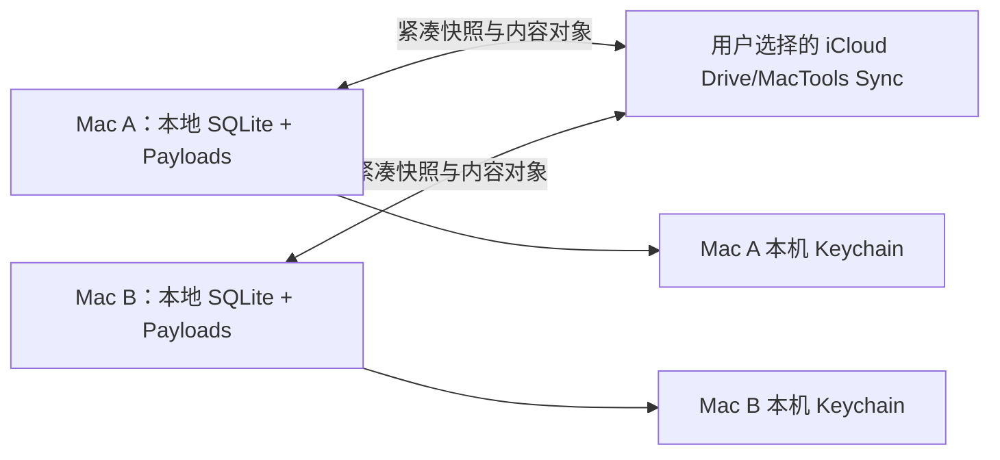

# MacTools iCloud Drive 多设备同步设计

## 文档状态

- 状态：方案已确认，待书面评审。
- 适用平台：macOS 26+。
- 同步后端：用户选择的 iCloud Drive 普通文件夹，不使用 CloudKit、应用专属 iCloud Container 或 APNs。
- 已确认：本地 SQLite 始终是运行时数据源，不直接同步数据库、WAL、SHM 或本地 Payload 目录。
- 已确认：默认同步对象容量上限为 `512 MiB`，全局普通剪贴板历史上限为 500 条。
- 已确认：不增加 MacTools 自有同步主密钥或应用层内容加密；Bailian API Key 不进入同步目录。

本方案替代《统一存储与 iCloud 同步改动需求与技术方案》中的 CloudKit 传输、CloudKit 加密、账号绑定、推送通知和正式签名要求；统一本地存储、Payload 生命周期、500 条本机懒淘汰、配置字段时钟和 tombstone 规则继续有效。

## 目标与边界

### 目标

1. 免费 Apple Developer 账号和 ad-hoc 签名构建也能通过用户自己的 iCloud Drive 在多台 Mac 间同步。
2. 同步剪贴板文字、URL、原始剪贴板图片、收藏/置顶状态和账号级普通配置。
3. 支持多台设备同时在线、离线修改和恢复联网后的最终收敛。
4. 将稳态同步对象控制在 `512 MiB` 以内，避免无限消耗用户 iCloud 空间。
5. 同步失败、文件未下载或容量不足时，本地剪贴板、搜索、复制和设置编辑保持可用。

### 边界

| 范围 | 当前方案 |
| --- | --- |
| Finder 文件、文件夹、图片文件路径 | 不同步；其他设备上的路径通常无效 |
| Bailian API Key | 只保存在每台 Mac 的本机 Keychain，需要时在新设备重新填写 |
| 数据保密 | 同步文件是用户 iCloud Drive 中的普通文件，不承诺应用层加密 |
| iCloud 总配额 | 普通文件夹 API 无法可靠取得用户完整 iCloud 剩余配额，只显示 MacTools 自身逻辑占用 |
| 本地历史 | 每台设备独立保留最多 500 条普通记录；收藏和置顶不参与本机自动淘汰 |
| 系统剪贴板 | 远端合并只更新 MacTools 历史，不自动写入 `NSPasteboard` |

## 方案选择

| 方案 | 优点 | 主要问题 | 结论 |
| --- | --- | --- | --- |
| 每设备紧凑快照 + 共享内容对象 | 单写者、文件数量少、内容可去重、容量容易统计 | 需要快照版本和原子替换 | 采用 |
| 每设备每记录一个状态文件 | 单写者、局部修复简单 | 产生大量小文件，iCloud Drive 枚举和同步成本高 | 不采用 |
| 不可变事件日志 | 完整审计、天然保留并发事件 | 文件无限增长，必须增加分段、压缩和 checkpoint | 不采用 |
| 多设备共享一个 SQLite 或状态文件 | 初始实现少 | 离线覆盖、WAL 损坏和 iCloud 冲突版本不可控 | 禁止 |

## 总体结构



每台设备只写自己的 `replicas/<deviceID>/`、`evictions/<deviceID>.json`、`resets/<deviceID>.json` 和以本机 ID 命名的设备移除标记。共享 `objects/` 中的文件以 SHA-256 内容寻址；相同路径必须对应相同字节，因此多设备并发创建可以通过校验后复用。编码和图片复制使用本地 `Store/Payloads/staging/`，临时文件不进入 iCloud Drive。

## iCloud Drive L1 结构

```text
<用户选择的文件夹>/MacTools Sync/
├── protocol.json
├── objects/
│   ├── text/
│   │   └── sha256/<前两位>/<SHA-256>.json
│   └── images/
│       └── sha256/<前两位>/<SHA-256>.png
├── replicas/
│   └── <deviceID>/
│       ├── manifest.json
│       ├── clipboard.json
│       ├── preferences.json
│       └── tombstones.json
├── evictions/
│   └── <deviceID>.json
├── resets/
│   └── <deviceID>.json
├── removed-devices/
│   └── <被移除设备ID>/
│       └── <执行移除设备ID>.json
└── .mactools-keep
```

### 文件职责

| 文件或目录 | 内容 | 写入所有者 |
| --- | --- | --- |
| `protocol.json` | 协议版本、store ID、创建时间和容量口径 | 初始化设备；已存在时只校验 |
| `objects/text/` | 规范化文字或 URL 内容，一种内容只保存一次 | 任意设备，按哈希校验后复用 |
| `objects/images/` | 标准化 PNG 原图，一种内容只保存一次 | 任意设备，按哈希校验后复用 |
| `manifest.json` | 设备 ID、代次、单调 revision、已读取的各设备 revision、更新时间和快照摘要 | 目录所属设备 |
| `clipboard.json` | 当前同步剪贴板引用、字段时钟和设备活动时间 | 目录所属设备 |
| `preferences.json` | 当前账号级配置领域与字段时钟 | 目录所属设备 |
| `tombstones.json` | 用户主动删除和重复 Record 收敛标记 | 目录所属设备 |
| `evictions/` | 容量或全局条数淘汰的观察值 | 文件名对应设备 |
| `resets/` | 同步数据代次提升标记 | 文件名对应设备 |
| `removed-devices/` | 用户移除旧设备后的持久标记；第二级文件名保证每个执行设备只写自己的文件 | 执行移除的设备 |
| `.mactools-keep` | 防止空目录布局在同步尚未建立时消失，不含业务数据 | 初始化设备 |

所有 JSON 使用稳定字段名、排序 key 和无缩进编码。快照包含 schema version，未知字段忽略，未知主版本停止写入并提示升级，避免旧版本破坏新格式。

## 内容对象与去重

### 文字和 URL

共享对象只保存不可变的规范化正文、类型、内容哈希和字节数。来源应用、捕获时间、使用时间、收藏、置顶和逻辑时钟保存在设备快照中，避免每台设备重复保存正文。

### 图片

图片继续使用本地 Payload 管线：解码、统一为 PNG、计算 SHA-256、staging 校验后提交。同步目录的图片路径为：

```text
objects/images/sha256/<hash 前两位>/<完整 SHA-256>.png
```

下载完成后必须重新计算 SHA-256。哈希不一致、文件尚未完整下载或 PNG 解码失败时，不写入本地 Payload 和数据库；保留远端快照引用并等待下一次同步重试。

SHA-256 只用于内容标识、去重和完整性校验，不是加密。数据库与快照保存相对标识，不保存另一台设备的绝对路径。

## 快照与并发模型

### 单写者规则

- 同一设备的同步任务串行执行，同一时间最多一个快照写事务。
- 一台设备禁止改写另一台设备的 `replicas/<deviceID>/`。
- 快照先写入本地 staging，完成编码、长度和 SHA-256 校验后，通过 `NSFileCoordinator` 原子替换目标文件；iCloud 目录不保存长期临时文件。
- `manifest.json` 最后写入；只有 manifest revision 和快照摘要匹配的一组文件才可应用。
- iCloud 冲突副本只有在内容校验一致时自动删除；内容不一致时保留并显示同步失败，不静默选边。

### 版本与应用顺序

每个设备维护单调递增的 `revision`。同步周期按以下顺序读取和合并：

1. 校验 `protocol.json` 和最高 reset generation。
2. 处理 removed-device 标记，被移除的旧设备必须生成新 device ID 后重新加入。
3. 读取全部设备 manifest，仅应用摘要匹配且 generation 有效的快照。
4. 先合并 tombstone，再合并内容引用和 DeviceReplica 活动时间。
5. 按领域和字段逻辑时钟合并配置。
6. 计算全局普通历史 keep set 和容量淘汰结果。
7. 合并结果写入本地 SQLite；远端图片经本地 staging 验证后进入本地 Payload 对象库。
8. 将本机 outbox 物化为共享内容对象和本机新快照，读回校验成功后才确认 outbox。
9. 清理本地 staging，并对无引用共享对象执行 GC。

同一字段并发修改仍按 `(logicalClock, deviceID)` 稳定决胜。相同正文或图片在不同设备产生不同本地 UUID 时，先按内容 SHA-256 合并，再保留稳定 winner ID；tombstone 和设备活动统一映射到 winner。

## 存储上限

### 固定默认值

| 项目 | 默认值 | 说明 |
| --- | --- | --- |
| 稳态同步目录容量 | `512 MiB` | `536,870,912` 字节；设置可选 256 MiB、512 MiB、1 GiB、2 GiB |
| 全局普通历史 | 500 条 | 所有设备合并后的逻辑内容数量，不是每台各 500 条 |
| 单个图片对象 | 64 MiB | 超过后保留本地但不上传，避免单文件占满同步空间 |
| GC 稳定期 | 24 小时 | 避免引用快照尚未下载完成时提前删除对象 |
| 本地 staging 保留期 | 24 小时 | 超时且不在活动事务中的本地临时文件可删除，不占用 iCloud 空间 |

512 MiB 是 `MacTools Sync/` 稳态普通文件逻辑大小预算，包含唯一内容对象、快照、墓碑和协议文件。容量决策按实际非对象文件大小为元数据保留空间，再把剩余预算分配给 `objects/`；不会用固定估算掩盖墓碑或快照增长。原子替换可能产生短暂双份文件，但单个图片限制和串行写入保证同一时间最多增加一个待提交对象。设置页不得把该数字描述为用户完整 iCloud 剩余容量。

### 淘汰优先级

普通记录同时受全局 500 条和 512 MiB 容量限制。合并所有设备活动后按以下顺序选择最旧内容：

```text
max(lastCapturedAt, lastUsedAt) ASC
createdAt ASC
contentHash ASC
```

- 收藏和置顶不参与自动淘汰，但其对象字节计入 512 MiB。
- 云端淘汰只停止该内容继续占用同步空间，不删除任一设备的本地历史。
- 降低容量档位时，先淘汰普通对象；收藏和置顶对象不自动删除。
- 如果收藏和置顶对象已经达到或超过上限，暂停新增图片对象上传；文字、URL、配置和删除标记继续同步。
- 单个图片超过 64 MiB 时仅跳过该图片，其他同步继续执行。

### 防止旧设备误淘汰

容量淘汰标记保存 `contentID`、原因、执行设备、`observedRetentionAt`、代次和时间。若任一有效设备快照包含更晚的活动时间或更新的收藏/置顶时钟，该标记失效；下一轮可以重新同步该内容并选择其他候选项。

共享对象只有在以下条件全部成立时才能物理删除：

1. 所有当前可见且未被移除的有效设备快照都没有存活引用。
2. 不存在收藏或置顶引用。
3. 最新无引用状态已经持续至少 24 小时。
4. 所有未移除设备的 manifest 和其引用快照均已下载、摘要一致；任何设备状态不可验证时暂停 GC。
5. 对象不在本机活动 staging 事务中。
6. 对象路径和内容 SHA-256 一致。

若极端情况下引用快照晚于 GC 到达，拥有本地 Payload 的设备会检测共享对象缺失并按相同 SHA-256 重新上传；本地数据不因云端 GC 丢失。

## 文件夹选择与持久化

- 设置页通过 `NSOpenPanel` 选择目录，默认定位到 iCloud Drive，不硬编码 `~/Library/Mobile Documents/...`。
- 首台设备选择空的父目录时创建 `MacTools Sync/`；其他设备可直接选择已存在且包含 `protocol.json` 的 `MacTools Sync/`。界面最终只保存和显示实际协议根目录，禁止嵌套创建同名目录。
- 本机在 `device_overrides` 保存 bookmark data、显示路径和 device ID；目录位置不跨设备同步。
- 当前应用未启用 App Sandbox，仍使用 bookmark 以处理目录移动和为未来沙盒化保留边界。
- 用户也可选择普通本地目录用于测试；设置页明确显示“未确认由 iCloud Drive 管理”，不宣称已经跨设备同步。
- 文件夹不可访问、bookmark 失效或 iCloud Drive 未登录时停止同步写入，本地 outbox 保留。

## 状态与设置入口

“设置 → 数据与同步”沿用现有 Liquid Glass 设置卡片，不新增独立窗口。主要状态为：

| 状态 | 显示与行为 |
| --- | --- |
| 未选择文件夹 | 引导选择同步目录；开关不可开启 |
| 已关闭 | 保留目录和本地 outbox，不读写同步文件 |
| 正在同步 | 后台读取、合并或写入；本地操作不等待 |
| 等待 iCloud 下载 | 请求下载占位文件，完成后自动重试 |
| 已同步 | 显示最后成功时间、逻辑用量和普通历史数量 |
| 容量已满 | 暂停新增图片上传，展示占用原因和调整入口 |
| 文件夹不可用 | 提供重新选择或重新授权目录 |
| 协议版本不兼容 | 只读并提示升级，禁止旧版本继续写入 |
| 同步失败 | 保留 outbox，提供错误摘要和“立即同步” |

卡片信息层级：同步状态和 `已使用 / 512 MB` 是首要信息；文件夹路径、图片/文字/元数据拆分和普通历史 `x / 500` 为次级信息；更换目录、打开目录、立即同步和清空同步数据为操作区。容量数字使用等宽数字；状态、警告和危险操作沿用现有语义颜色与原生控件。

关闭同步不删除本机或目录数据。清空同步数据需要二次确认：提升 reset generation，使所有设备忽略旧代快照和对象；本机数据保留，重新开启后只从当前仍存在的本机数据建立新代次。

## 异常与恢复

| 场景 | 处理 |
| --- | --- |
| 文件只存在 iCloud 占位符 | 调用下载请求，显示等待状态，不创建缺图记录 |
| 快照写到一半应用退出 | manifest 未更新，其他设备继续使用上一 revision |
| manifest 与快照摘要不符 | 跳过该设备本轮状态并重试，不部分应用 |
| 图片哈希或 PNG 校验失败 | 隔离损坏文件，保留引用并等待拥有正确本地对象的设备修复 |
| 多设备同时写同一内容对象 | 校验 SHA-256 后复用；相同路径不同内容视为损坏 |
| 达到 512 MiB | 淘汰普通云端对象；无法再淘汰时暂停新图片，其他同步继续 |
| 同步文件夹被用户移动 | 使用 bookmark 重新解析；失败时要求重新选择 |
| 同步文件夹被用户删除 | 停止写入并保留本地 outbox，不自动重建到未知位置 |
| 旧设备长期离线 | 其快照继续保护引用；用户移除设备后才释放该设备独占对象 |
| 已移除设备重新上线 | 检测 removed-device 标记，放弃旧 outbox并以新 device ID 重新 bootstrap |

### Tombstone 压缩

`manifest.json` 保存本设备已经完整应用的 `seenRevisions[deviceID]`。每个 tombstone 记录来源设备和来源 revision；只有所有未移除设备都确认读取到该 revision 后，才允许从来源设备的新快照中移除 tombstone。长期离线设备会阻止压缩但不会阻止普通同步；用户显式移除旧设备后，该设备不再参与确认集合。被移除设备重新上线必须更换 device ID，因此不能用旧快照复活已压缩删除项。

同一目标的多个 tombstone 只保留当前 generation 内逻辑时钟最大的一个；低代次 tombstone 在所有设备采纳更高 reset generation 后删除。该规则把墓碑数量限制在尚未被全体确认的删除集合，而不是随使用年限无限增长。

## 代码调整范围

| 位置 | 调整 |
| --- | --- |
| `Sources/MacToolsCore/Sync/` | 将 CloudKit 命名收敛为传输无关 `SyncRecordPayload`、`SyncLocalRepository`，增加快照协议、容量策略、合并和 GC 决策 |
| `Sources/MacTools/App/Sync/` | 删除 `CloudKitSyncCoordinator` 与 `CloudKitRecordMapper`，增加文件协调、bookmark、iCloud 下载状态和周期扫描适配 |
| `DeviceOverrideRepository` | 保存同步开关、目录 bookmark、显示路径、device ID 和本机 revision |
| `ClipboardDatabase` | V7 移除 CloudKit system fields/账号状态，增加文件快照 receipt、对象 GC 观察时间和目录身份状态 |
| `AppEnvironment` | 注入 iCloud Drive 协调器，移除 CloudKit capability 检查、账号切换和远程通知入口 |
| `SettingsView`、`RuntimeViews` | 增加目录选择、容量档位、使用量、等待下载、容量已满和旧设备管理状态 |
| `scripts/package_app.sh` | 删除 CloudKit、APNs、Container、Provisioning Profile 参数和 entitlement 门禁；ad-hoc 构建可使用文件同步 |
| `KeychainCredentialStore` | 保持本机非同步 Keychain；不因 iCloud Drive 开关改变凭据存储方式 |

当前没有正式 CloudKit 线上数据需要迁移。首次选择目录时清理旧 CloudKit outbox，再根据当前本地数据和同步范围生成完整本机快照；本地剪贴板、Payload 和普通配置不重建、不丢弃。

## 测试与验收

### 自动化测试

| 场景 | 预期 |
| --- | --- |
| 两个独立数据库写入同一临时同步目录 | 并发新增、删除和配置修改最终收敛 |
| 两台设备复制相同文字和图片 | 共享内容对象各只有一份 |
| 501 条普通云端内容 | 稳定淘汰到 500，收藏和置顶保留 |
| 对象超过 512 MiB | 按活动时间淘汰普通对象；本机记录保留 |
| 收藏对象占满容量 | 不删除收藏；暂停新图片，文字和配置继续同步 |
| stale eviction 遇到更新活动 | 淘汰标记失效，较新内容保留 |
| manifest 与快照摘要不一致 | 不部分应用，上一 revision 保持有效 |
| 图片未下载、损坏或哈希不符 | 不写入本地 Payload，后续可重试修复 |
| 写入成功但读回校验失败 | outbox 不确认，下一轮重试 |
| 同步目录丢失或 bookmark 失效 | 本地功能正常，状态进入文件夹不可用 |
| reset 与离线旧快照 | 旧代数据不能复活 |
| 被移除设备重新上线 | 生成新 device ID，不上传旧 outbox |
| tombstone 被全部设备确认 | 新快照压缩已确认删除项，离线或已移除设备不能复活内容 |

文件系统、时钟、下载请求、bookmark 和协调写入均通过协议注入；单元测试不依赖真实 iCloud 账号。集成测试使用两个临时本地目录客户端模拟多设备交错上传、延迟下载和乱序到达。

### 真实环境验收

1. 使用免费 Apple Developer 账号或 ad-hoc 签名包，在 Mac A 选择 iCloud Drive 目录并开启同步。
2. Mac B 选择同一个目录，验证文字、URL、原始图片和普通配置双向同步。
3. 两台 Mac 离线并发新增相同内容、修改不同配置字段，恢复联网后验证去重和字段级收敛。
4. 将普通同步历史推到 501 条，确认云端 keep set 为 500，本机各自仍遵守本地 500 条规则。
5. 使用测试容量覆盖将对象推到上限，验证普通图片淘汰、收藏保护和其他类型继续同步。
6. 让一台设备保持离线超过 GC 稳定期，确认另一台不会删除仍被其快照引用的对象。
7. 在浅色、深色和窄窗口检查目录选择、用量、容量已满、等待下载、文件夹不可用和危险确认状态。

## 完成标准

- 构建和运行不再依赖 CloudKit、iCloud Container、APNs、付费会员或 Provisioning Profile。
- 多设备不共享写 SQLite、WAL、SHM 或同一可变快照文件。
- 相同文字和图片在同步目录只保存一份不可变内容对象。
- 全局普通云端历史稳定收敛到 500 条，稳态同步对象默认受 512 MiB 限制。
- 自动容量淘汰不删除本地历史，不删除收藏或置顶内容。
- 图片和快照只有通过摘要、格式和原子提交校验后才能进入本地状态或确认 outbox。
- 配置同步排除设备覆盖、目录 bookmark、权限状态和 Bailian API Key。
- 双机离线、并发、乱序、容量不足、目录丢失和重置场景有明确恢复结果。
