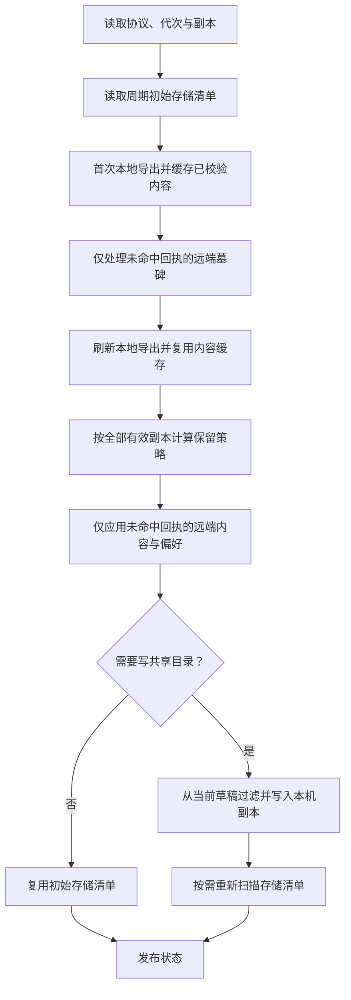

# P1 同步与事件日志性能优化设计

## 文档状态

- 状态：已实施并通过自动化验证。
- 适用平台：macOS 26+。
- 关联方案：`docs/superpowers/specs/2026-07-20-icloud-drive-sync-design.md`。
- 验收结果：本机单元测试、严格并发构建、打包启动和设置页检查已通过；真实双 Mac iCloud Drive 同步由人工验证。

## 目标与边界

### 目标

1. 保持剪贴板、偏好设置、墓碑、容量裁剪、设备管理和同步状态语义不变。
2. 减少单次同步周期内重复的数据库读取、图片读取、哈希计算和目录遍历。
3. 使用现有副本回执跳过已经完整应用且未变化的远端副本。
4. 将 `debug.log` 文件操作移出超级右键事件回调，避免阻塞事件处理。
5. 用确定性的操作次数约束防止性能回退，耗时数据只作为前后对比证据。

### 当前方案边界

| 范围 | 当前方案 | 原因与影响 |
| --- | --- | --- |
| 同步协议与快照格式 | 保持不变 | 不引入跨版本兼容风险 |
| 数据库 schema | 保持不变 | 现有 `file_sync_receipts` 已能支持快路径 |
| 数据库批量 upsert | 不调整 | 先消除重复应用；仍有写放大证据时再单独设计 |
| 同步调度 | 保持 30 秒周期和现有立即同步触发 | 不改变同步时效约定 |
| 协调器总体拆分 | 保留现有入口和线程模型 | 依赖注入与长函数拆分属于 P2 |
| UI 与用户设置 | 保持不变 | P1 只优化内部执行路径 |

## 现状与性能基线

`ICloudDriveSyncCoordinator.performCycle` 在一次周期中存在以下重复工作：

| 操作 | 无云端写入 | 有云端写入 |
| --- | ---: | ---: |
| `exportBundle` | 2 次 | 3 次 |
| `storedObjects` | 2 次 | 2 次 |
| `usage` | 2 次 | 2 次 |
| 已应用远端副本的本地 apply | 每周期重复 | 每周期重复 |

每次 `exportBundle` 都会读取全部同步范围内的本地记录；图片载荷会重复读取并校验 SHA-256。`storedObjects` 和 `usage` 分别遍历对象目录与同步根目录。超级右键按下和抬起时，`Logger` 会在事件回调中同步创建目录、打开文件、追加、关闭文件并校验权限。

## 总体设计

P1 维持 `ICloudDriveSyncCoordinator` 的编排职责，只增加四个可独立测试和回退的局部能力。

## 周期内导出复用

### 内容缓存

`MacToolsCore` 增加周期内使用的导出内容缓存，键由 `ClipboardContentKind` 和 `contentID` 组成。缓存只保存已经完成格式与内容哈希校验的数据：

- 文字和 URL 保存规范化编码后的 `SyncExportContent`。
- 图片保存读取并完成 SHA-256 校验后的 PNG 数据。
- 文件缺失、读取失败、超限或哈希不匹配的结果不进入缓存，后续导出仍可重试。
- 缓存不跨同步周期持久化，不改变载荷生命周期或内存常驻策略。

首次导出仍发生在远端墓碑应用前，以保留本机已有内容作为远端缺失对象的修复来源。墓碑应用后进行第二次导出，刷新当前记录、不可用记录和 outbox 截止时间，同时复用首次导出中已校验的内容。

### 最终写入包

容量决策完成后，不再第三次读取数据库和载荷。最终写入包由第二次导出结果按以下集合过滤生成：

- 远端有效驱逐内容；
- 本机容量决策驱逐内容；
- 因容量不足暂停上传的新增图片。

被阻塞或不可用的记录继续保留在 outbox，不会被 `acknowledgeSnapshot` 错误确认。第二次导出截止点之后出现的变化不进入当前快照，并继续留在 outbox，等待立即触发或下一周期同步。

## 副本回执快路径

同步周期读取 `SyncLocalRepository.receipts()` 并按设备建立索引。回执只有在以下字段全部相同时才命中：

- `deviceID`；
- `generation`；
- `revision`；
- `manifestDigest`。

命中回执的副本仍参与以下计算：

- 全局保留候选与容量裁剪；
- `seenRevisions` 更新与墓碑压缩确认；
- 设备列表、更新时间和同步状态；
- 共享对象引用集合与垃圾回收保护。

快路径只跳过重复的共享内容对象读取、墓碑应用、剪贴板 upsert、偏好设置合并和回执重写；manifest 与三个快照文件仍按现有摘要规则读取和验证。同步目录变化、reset generation 提升或设备身份轮换时，沿用现有逻辑清空回执。内容未下载、不完整或校验失败的副本不记录回执，后续周期继续重试。

## 统一存储清单

`DriveSyncStore` 增加一次遍历生成的存储清单，包含：

- 合法文字和图片对象的 `contentID`、类型与字节数；
- 图片对象、文字对象和元数据的分类字节数；
- 给定容量上限和普通历史数量对应的 `SyncStorageUsage`。

同步周期开始时读取一次清单，用于已存对象判断、候选字节数、容量决策和 GC 输入。共享目录没有发生写入或删除时，最终状态复用该清单，只替换普通历史数量。发生以下任一操作后重新遍历一次：

- 写入本机副本快照或内容对象；
- 更新驱逐快照；
- 删除无引用共享对象。

原有 `storedObjects()` 和 `usage()` 行为继续保留并由统一清单实现，避免影响其他调用方。

## 事件日志异步落盘

`Logger.info` 和 `Logger.error` 保持以下同步行为：

- 立即更新内存消息；
- 立即发送到 `NSLog`；
- 保持原有日志文本格式。

`debug.log` 的目录准备、权限校验、文件打开、追加和关闭改由专用串行队列执行，确保不同日志调用的文件顺序不变。`flush()` 等待已排队写入完成，用于单元测试和应用退出流程。目录权限继续为 `0700`，文件权限继续为 `0600`；后台写入失败继续通过 `NSLog` 报告，不影响调用方。

## 一致性与异常处理

| 场景 | 处理 |
| --- | --- |
| 回执任一字段不一致 | 视为新副本，完整读取、合并并在成功后更新回执 |
| 副本内容未下载 | 请求 iCloud 下载，保持等待状态，不写回执 |
| 副本或内容损坏 | 保持现有隔离与失败状态，不部分应用 |
| 本地载荷首次读取失败 | 不缓存失败结果；第二次导出和后续周期仍可恢复 |
| 周期中出现新本地变化 | 不越过导出 cutoff 确认，保留 outbox 并进入后续周期 |
| 共享目录写入后重新扫描失败 | 当前周期失败，不发布基于旧清单的成功状态 |
| 日志后台写入失败 | 通过 `NSLog` 报错；右键事件处理继续执行 |
| 应用退出 | 退出回调等待日志队列 flush，降低尾部日志丢失风险 |

## 功能锁定测试

实现优化前先补充或强化以下测试：

| 测试类别 | 断言 |
| --- | --- |
| 导出一致性 | 使用和不使用周期缓存得到相同记录、内容、偏好、墓碑和不可用记录 |
| 最终包过滤 | 被驱逐或暂停的内容不进入快照，相关 outbox 仍保持待处理 |
| 回执匹配 | 四个字段全部相同才命中；任一字段变化都重新应用 |
| 多副本收敛 | 文字、图片、收藏、置顶与偏好设置结果保持一致 |
| 删除与容量 | 旧副本不能恢复墓碑记录；容量裁剪、驱逐和 GC 结果保持一致 |
| 异常恢复 | 未下载、损坏内容和不完整副本保持原有状态并允许重试 |
| 存储清单 | 统一清单与原 `storedObjects()`、`usage()` 的对象和字节结果一致 |
| 日志 | 内存消息立即可见；`flush()` 后文件内容、顺序和权限正确 |

## 性能验收

确定性操作预算作为自动化和代码审查的硬指标：

| 指标 | 目标 |
| --- | --- |
| 同一本地导出内容的读取与哈希校验 | 每周期最多 1 次 |
| 完整本地导出 | 每周期最多 2 次 |
| 最终写入前完整导出 | 0 次，直接过滤第二次导出结果 |
| 同步根目录完整递归遍历 | 无共享目录变更时 1 次，有变更时最多 2 次 |
| 已命中回执副本的本地 apply | 0 次 |
| 右键事件回调内的日志文件操作 | 0 次 |

使用包含 500 条剪贴板记录和图片载荷的固定样本记录优化前后耗时与操作次数。耗时结果受磁盘缓存和机器负载影响，只作为效果证据，不设置不稳定的毫秒级测试阈值。

## 实施顺序与验证

1. 增加行为锁定测试和固定样本性能基线。
2. 增加导出内容缓存与最终包过滤，运行同步仓库聚焦测试。
3. 启用回执快路径，运行多副本、墓碑、异常恢复和容量测试。
4. 增加统一存储清单，运行存储与 GC 聚焦测试。
5. 将日志文件写入移到串行后台队列，运行日志与超级右键路由测试。
6. 运行完整 `swift test`、严格并发构建、脚本语法检查、敏感信息扫描和 `git diff --check`。
7. 构建并启动打包应用，检查启动、同步状态和超级右键诊断；真实双 Mac 同步由人工验证。

每个优化步骤保持独立 commit。任一步出现行为差异时停止后续优化，先修复或回退该步骤。
