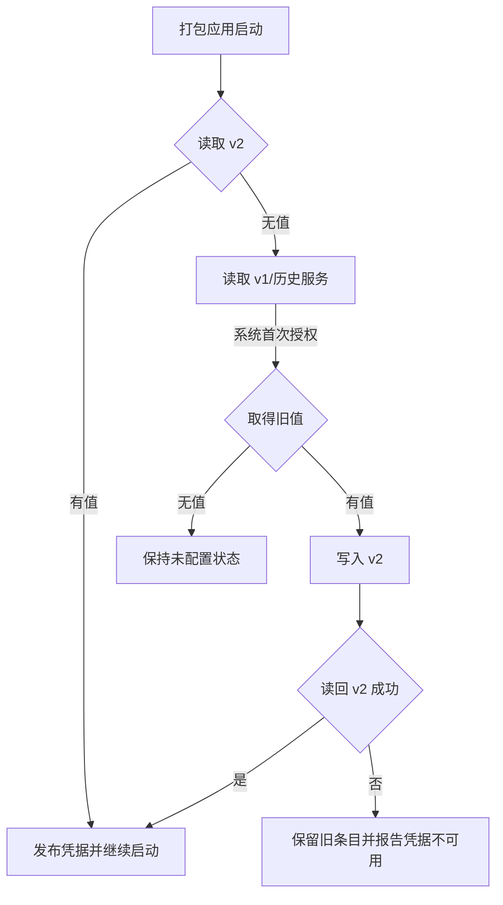

# MacTools 固定 ad-hoc 身份与 Keychain 凭据迁移设计

## 文档状态

- 状态：实机验证失败，方案已否决。
- 适用平台：macOS 26+。
- 目标场景：个人本机使用，通过 `scripts/rebuild_and_run_app.sh` 反复替换并启动打包应用。
- 已确认：不依赖 Apple Development、Developer ID 或自签名证书。
- 已确认：百炼 API Key 继续只保存在本机 Keychain，不进入 SQLite、普通配置、同步数据或日志。
- 已确认：首次迁移启动允许出现一次 Keychain 授权；完成迁移后，后续普通启动和重新构建不得再次出现密码框。

## 现状与根因

`AppEnvironment.start()` 每次启动都会读取服务 `com.mactools.credentials.v1` 下的百炼 API Key。现有条目可能由 `swift run`、旧签名方式或不同代码身份创建，其访问控制没有稳定绑定到当前打包应用，因此 `SecItemCopyMatching` 会等待 Keychain 授权并反复显示密码框。

当前 ad-hoc 打包已经显式写入：

```text
designated => identifier "local.mactools.mvp"
```

原拟方案假设 Designated Requirement（DR）可以让两个 ad-hoc 构建保持同一 Keychain 身份，因此计划让新条目由固定 DR 的打包应用创建。实机验证证明默认 Keychain ACL 仍区分不同 ad-hoc 构建，该假设不成立。

## 目标与边界

| 范围 | 当前方案 |
| --- | --- |
| 首次迁移启动 | 直接读取旧 Keychain 条目，允许系统显示一次授权 |
| 后续启动 | 启动阶段继续直接读取 Keychain，不使用懒加载，不再显示密码框 |
| 重新构建 | 二进制和 cdhash 可以变化，Bundle ID 与 DR 必须保持一致 |
| 凭据存储 | 只存入登录 Keychain，不增加明文副本 |
| 旧 Keychain 条目 | 迁移成功后停止读取，暂不自动删除，避免额外授权和凭据丢失 |
| 其他系统权限 | 不承诺解决辅助功能、输入监控、屏幕录制或 Finder 自动化的 TCC 继承 |
| 分发 | 不用于对外分发、Gatekeeper 信任或公证 |

## 方案选择

| 方案 | 优点 | 主要问题 | 结论 |
| --- | --- | --- | --- |
| 固定 ad-hoc DR + 新 Keychain 服务迁移 | 保留 Keychain；预期首次授权后跨本机构建复用 | 实机验证中仍按具体 ad-hoc 构建重复授权 | 否决 |
| Keychain ACL 允许所有应用 | 不依赖任何代码身份 | 任意本地应用都可读取 API Key | 禁止 |
| `0600` 文件保存 API Key | 实现简单、不会显示 Keychain 窗口 | 仍是明文凭据，并增加新的敏感存储位置 | 禁止 |

## 原拟固定应用身份

原拟让本地打包默认强制使用 ad-hoc 签名，不再自动选择后来出现的 Apple/Developer 证书。固定条件为：

```text
CFBundleIdentifier = local.mactools.mvp
designated => identifier "local.mactools.mvp"
```

`scripts/package_app.sh` 仍保留显式切换受信任证书的能力，但本地默认路径必须稳定落到 ad-hoc 分支。任何 Bundle ID 或 DR 变更都视为凭据身份迁移，不能作为普通重构合入。

该身份定义仅为原拟方案。实机结果证明它不能作为稳定 Keychain ACL 身份，不得应用到打包脚本。

## 原拟 Keychain 迁移

### 服务版本

| 服务 | 职责 |
| --- | --- |
| `com.mactools.credentials.v2` | 当前读写服务，由固定 ad-hoc DR 的打包应用创建 |
| `com.mactools.credentials.v1` | 旧服务，只在 v2 缺失时读取一次 |
| `local.mactools.mvp` 等历史服务 | 保留现有兼容读取顺序，只在前述服务均无值时尝试 |

### 启动流程



迁移顺序必须满足：

1. 始终先读 v2，避免已迁移设备再次触碰旧 ACL。
2. 只有 v2 不存在时才读取 v1 和更早服务。
3. 取得旧值后先写 v2，再读回验证。
4. v2 写入或验证失败时保留旧条目，下一次启动可安全重试。
5. 不自动删除 v1，避免删除授权产生第二次系统提示。
6. 新安装没有历史凭据时保持未配置；用户保存 API Key 后直接创建 v2。
7. 用户拒绝首次授权时，菜单栏、剪贴板、截图等非翻译功能继续可用，凭据状态显示不可用。

## 原拟安全边界

`identifier "local.mactools.mvp"` 没有可信证书锚点。任何能够在同一用户环境中运行、主动使用相同标识并构造兼容 ad-hoc DR 的代码，理论上都可能被 Keychain 视为同一应用更新。

原拟方案接受这一风险，原因是应用仅供本机个人使用，且替代方案是明文存储或允许所有应用访问。API Key 仍由登录 Keychain 加密保存，不进入同步和普通数据文件。若未来用于分发或处理更高价值凭据，必须切换到稳定受信任证书，并迁移到带可信锚点的新服务版本。

## 异常处理

| 场景 | 处理 |
| --- | --- |
| 用户拒绝 v1 授权 | 本次凭据不可用；不写 v2、不删除 v1 |
| v2 写入失败 | 继续保留 v1；记录错误类型，不记录 API Key |
| v2 读回失败 | 不标记迁移成功；下次启动重试 |
| v2 已存在但读取失败 | 不回退读取 v1，避免每次启动重复弹旧授权 |
| 打包脚本意外使用证书签名 | 验证失败；不得宣称身份稳定 |
| Bundle ID 或 DR 变化 | 视为破坏性身份变更，停止发布并重新评审迁移 |

## 验证

### 自动验证

- 聚焦测试覆盖 v2 优先、v1 迁移、写入失败保留旧值、v2 已存在时不读取 v1。
- 打包脚本测试覆盖本地默认 ad-hoc、固定 Bundle ID 和固定 DR。
- 运行相关聚焦测试后运行完整 `swift test`。
- 运行 `git diff --check` 和隐私关键词扫描，确认没有真实凭据进入受版本控制文件。

### 打包应用验证

1. 使用构建号 A 打包并启动，确认旧凭据迁移时最多出现一次 Keychain 授权。
2. 授权后确认翻译可用，且安全日志不再出现 Keychain 等待超时。
3. 使用不同构建号 B 重新打包，使 cdhash 变化。
4. 替换并启动构建 B，确认不再出现密码框，翻译仍可用。
5. 再次普通退出和启动构建 B，确认保持无提示。
6. 检查两次构建的 Bundle ID 与 DR 完全一致，签名均为 ad-hoc。
7. 确认 `settings.json`、SQLite、同步快照和日志均不包含 API Key。

如果构建 B 仍显示 Keychain 授权，说明当前 macOS 没有按该 ad-hoc DR 复用 Keychain ACL；此时停止实施，不自动降级为明文存储或“允许所有应用”，重新选择安全边界。

## 实机验证结论

2026-07-24 使用两个不同构建号完成打包验证：

| 检查项 | 构建 A | 构建 B |
| --- | --- | --- |
| 签名 | ad-hoc | ad-hoc |
| Team Identifier | 未设置 | 未设置 |
| Bundle ID | `local.mactools.mvp` | `local.mactools.mvp` |
| DR | `identifier "local.mactools.mvp"` | `identifier "local.mactools.mvp"` |
| cdhash | 与构建 B 不同 | 与构建 A 不同 |
| Keychain 结果 | 用户选择“始终允许”并创建 v2 条目 | 再次显示授权提示 |

系统 `securityd` 日志确认，构建 A 的“始终允许”完成后，构建 B 仍进入 `displaying keychain prompt`。这说明 Keychain 默认 ACL 没有仅按脚本显示的 identifier-only DR 跨 ad-hoc 构建复用身份。

Apple 的 TN3127 说明 ad-hoc 签名的 DR 与具体代码版本绑定；`SecTrustedApplication` 的受信任应用数据也包含用于识别具体应用的加密哈希。因此，固定 Bundle ID 和自定义显示 DR 不能满足“重新构建后不再请求密码”的要求。

当前结论：

- 不实施固定 ad-hoc DR + Keychain v2 迁移。
- 不降级为允许所有应用访问 Keychain，也不自动改用明文文件。
- 后续方案需要在稳定证书身份与降低凭据存储安全边界之间重新选择。

## 参考

- [Applying Code Requirements](https://developer.apple.com/documentation/security/applying-code-requirements)
- [TN3127: Inside Code Signing: Requirements](https://developer.apple.com/documentation/technotes/tn3127-inside-code-signing-requirements)
- [SecTrustedApplicationCopyData](https://developer.apple.com/documentation/security/sectrustedapplicationcopydata%28_%3A_%3A%29)
- [Technical Note TN2206: macOS Code Signing In Depth](https://developer.apple.com/library/archive/technotes/tn2206/)
